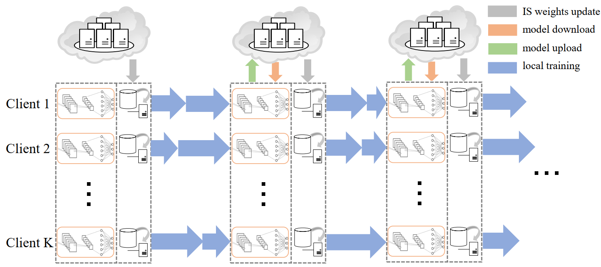

## ISFL: An Importance Sampling Solution to Non-i.i.d. FL.

This repository is the *PyTorch* implementation of ISFL, a **f**ederated **l**earning (FL) framework with **i**mportance **s**ampling (IS).

Z. Zhu, Y. Shi, P. Fan, C. Peng and K. B. Letaief, [ISFL: Federated Learning for Non-i.i.d. Data With Local Importance Sampling](https://arxiv.org/abs/2210.02119), IEEE Internet of Things Journal*, doi: 10.1109/JIOT.2024.3398398.

ISFL proceeds as the following work flow:



- The fine-grained convergence theorem with non-convex assumptions is derived for better compatibility with deep learning models. 

- The optimal importance sampling weights for local training data are also solved through a water-filling approach.

### References

- If you find the codes useful, please cite the following in your manuscript:

```bibtex
@article{zhu2024isfl,
  author={Zhu, Zheqi and Shi, Yuchen and Fan, Pingyi and Peng, Chenghui and Letaief, Khaled B.},
  journal={IEEE Internet of Things Journal}, 
  title={ISFL: Federated Learning for Non-i.i.d. Data With Local Importance Sampling}, 
  year={2024},
  volume={},
  number={},
  pages={1-1},
  doi={10.1109/JIOT.2024.3398398}
}
```

<hr>

